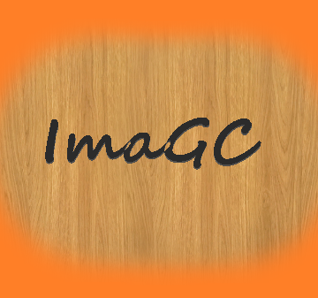
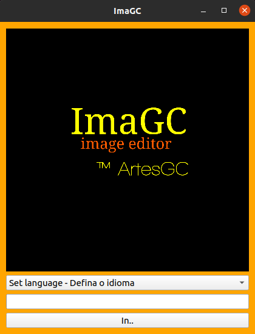
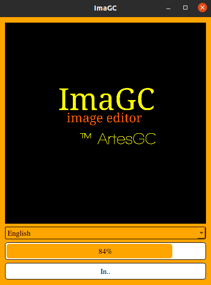
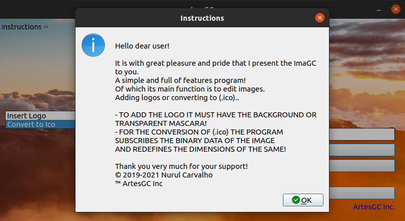
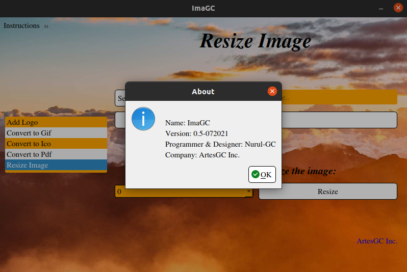

<div align="center">

[](https://sourceforge.net/projects/imagc/files/latest/download) \
[](https://sourceforge.net/projects/imagc/files/latest/download) \

  
# ImaGC
  
</div>

## Intro

```txt
Simplest Image Editor that ever existed,
but also full of functions..

The ImaGC allows the user:
- add logos to images;
- automatically resizes the image if necessary;
- convert a selected image to an icon (.ico);
```

***OBS: logos should have a transparent mask!***

## Demo





### Instructions and Information




---

<div align="center">


**For better experience and confirmation of the program power \
I made it available in the folders: \
`./ImaGC-ico`, `./ImaGC-logo`, `./ImaGC-pdf` and `./ImaGC-gif` \
some exemplary images converted into (.ico, .gif, .pdf) and with a logo added…**


***Enjoy!***

&copy; 2020-2021 [Nurul Carvalho](mailto:nuruldecarvalho@gmail.com) \
&trade; [ArtesGC](https://artesgc.home.blog)

</div>
