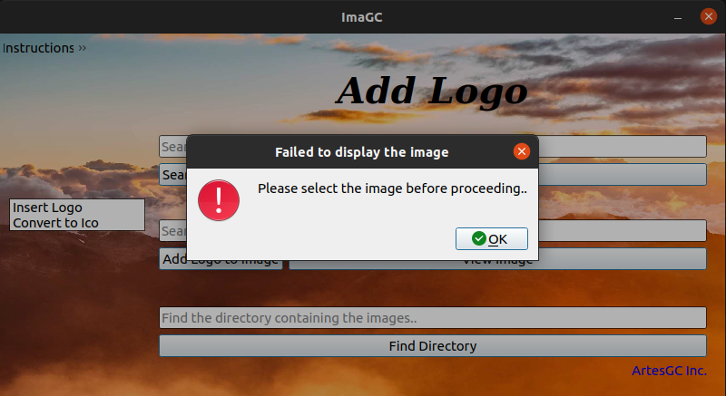
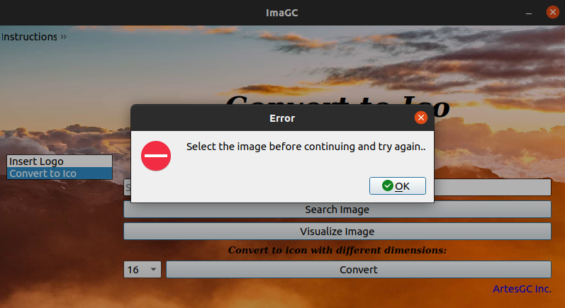

<div align="center">


  
# ImaGC
  
[](https://sourceforge.net/projects/imagc/files/latest/download) \
[](https://sourceforge.net/projects/imagc/files/latest/download) 
  
</div>

## Intro

```txt
Simplest Image Editor that ever existed,
but also full of functions..

The ImaGC allows the user:
- add logos to images;
- automatically resizes the image if necessary;
- convert a selected image to an icon (.ico);
```

***OBS: logos should have a transparent (background) mask!***

## Demo


## Instructions and Information


## Error

`fail to display image`


`error trying to convert ico`


**For better experience and confirmation of program capacity \
I made it available in the folders `./ImaGC-ico`, `./ImaGC-logo`, ``, some exemplary images \
converted into (.ico) and with a logo added…**

***Enjoy!***

---

&copy; 2019-2021 [Nurul Carvalho](mailto:nuruldecarvalho@gmail.com) \
&trade; [ArtesGC](https://artesgc.home.blog)
