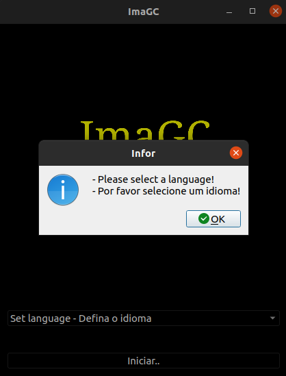

# ImaGC


## Intodução

```txt
Editor de Imagens mais simples que já existiu
porém, igualmente cheio de funções..

O ImaGC permite ao usuario:
- adicionar logotipos as imagens;
- redefine automaticamente o tamanho da imagem se necessário;
- converter uma imagem selecionada para icone (.ico);
```

***OBS: os logotipos devem ter uma mascara (fundo) transparente!***

## Demonstração




## Instruções e Informações


## Erros

`falha ao visualizar imagem`


`erro ao adicionar logotipo a imagem`


`erro ao converter para ico`


**Para melhor experiência e confirmação da capacidade do programa \
disponibilizei nas pastas `./ImaGC-ico` e `./ImaGC-logo` algumas imagens exemplares \
convertidas em (.ico) e com logotipo adicionado..**

***Faça Bom Proveito!***

---

&copy; 2019-2021 [Nurul Carvalho](mailto:nuruldecarvalho@gmail.com) \
&trade; [ArtesGC](https://artesgc.home.blog)
