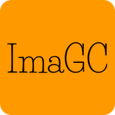

 \
 \

  

Simplest Image Editor that ever existed,
but also very functional...

- The ImaGC allows the user:
  - add logos to images;
  - automatically resizes the image if necessary;
  - convert a selected image into an Icon (.ico);
  - convert a range of selected images into a Graphic Interchange Format (.gif)
  - convert one or more images into a Portable Document Format (.pdf)

- I made available some exemplary images converted into (.ico, .gif, .pdf) and with a logo added, inside the folders:
  - `./demos/ImaGC-ico`
  - `./demos/ImaGC-logo`
  - `./demos/ImaGC-pdf`
  - `./demos/ImaGC-gif` 

***⚠️ OBS: logos should have a transparent mask!***

*[Click here for demonstrations..](https://github.com/ArtesGC/ImaGC/demos)* \
*[And here for the white paper..](https://artesgc.github.io/ImaGC)* \
Enjoy!

---

&copy; 2020 – 2022 [Nurul-GC](mailto:nuruldecarvalho@gmail.com) \
&trade;[ArtesGC](https://artesgc.home.blog)

